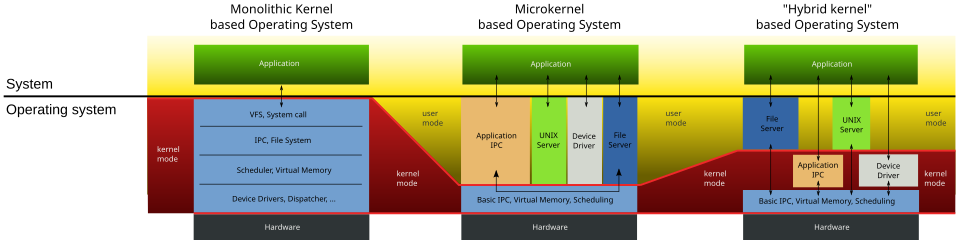

On most systems, the kernel is one of the first programs loaded on startup (after the bootloader).

The kernel's interface is a low-level abstraction layer. When a process requests a service from the kernel, it must invoke a system call, usually through a wrapper function.

### Ram 
Random-access memory (RAM) is used to store both program instructions and data. The kernel is responsible for deciding which memory each process can use, and determining what to do when insufficient memory is available.

### I/O
I/O devices include, but are not limited to, peripherals such as keyboards, mice, display devices, etc. The kernel provides convenient methods for applications to use these devices, which are typically abstracted by the kernel so that applications do not need to know their implementation details.

### Resources
Defining the execution domain (address space) and the protection mechanism used to mediate access to the resources within a domain. Kernels also provide methods for synchronization and inter-process communication (IPC). The kernel is also responsible for context switching between processes or threads.

### Memory
